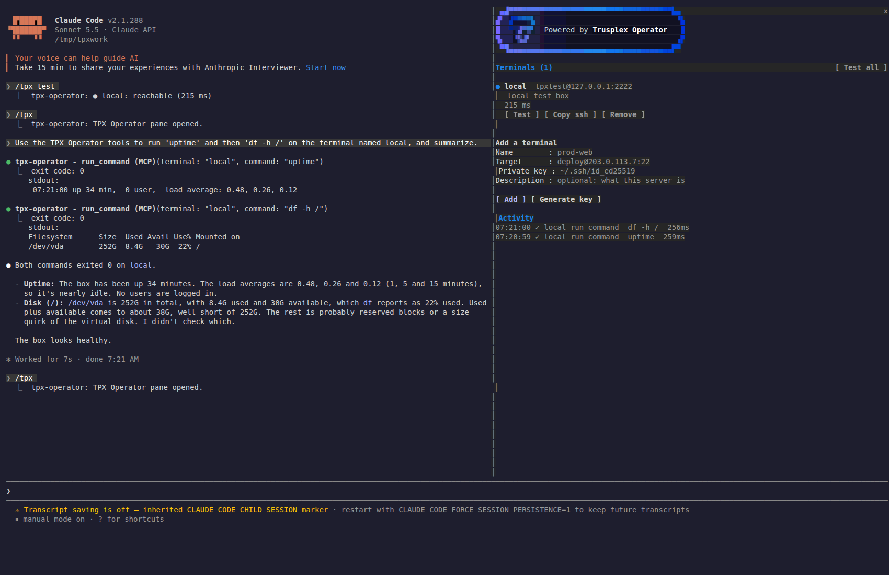
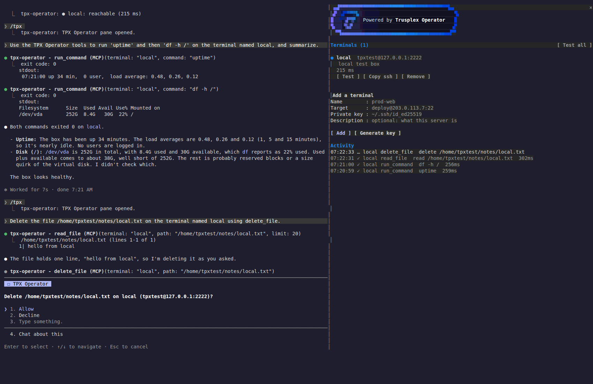
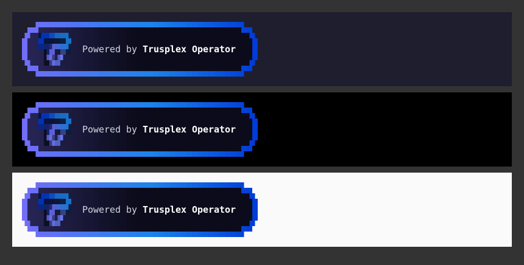
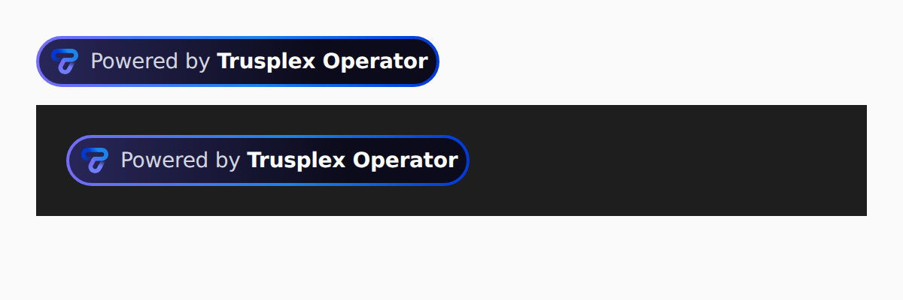

# TPX Operator for Claude Code

TPX Operator, rebuilt as a [Claude Code mod](https://github.com/anthropics/claude-code/tree/main/mods). You add your servers as named **remote terminals**, each one an SSH target plus a private key on your machine. Claude can then operate them by name from your machine, over SSH and SFTP. It gets the same toolset as TPX Operator, plus two tools for moving files between your machine and a server.



## Install

You need the OpenSSH client (`ssh`, `sftp`, and `ssh-keygen` for `/tpx keygen`) on your PATH.

```sh
# from a clone, for one session
claude --plugin-dir /path/to/TPX-Operator-ClaudeOSS

# or install it through the marketplace
/plugin marketplace add Bytestorm5/TPX-Operator-ClaudeOSS
/plugin install tpx-operator@trusplex
```

## Add a terminal

You can add a terminal from the prompt:

```
/tpx add prod-web deploy@203.0.113.7:22 ~/.ssh/id_prod prod web server (nginx + app)
```

You can also open the pane with `/tpx` and fill in the **Add a terminal** form. Every terminal is checked for reachability when it's added.

If you don't have a key for the server yet, run `/tpx keygen prod-web` (or press **Generate key** in the pane). It creates an ed25519 key pair in `~/.tpx-operator/keys/` and prints the public key for the server's `~/.ssh/authorized_keys`.

| Command | What it does |
| --- | --- |
| `/tpx` | Opens the Operator pane |
| `/tpx add <name> <user@host[:port]> <key> [description]` | Adds or updates a terminal |
| `/tpx keygen <name>` | Creates a key pair for a terminal |
| `/tpx remove <name>` | Forgets a terminal (nothing on the server changes) |
| `/tpx list` | Lists the terminals |
| `/tpx test [name]` | Checks that terminals are reachable |
| `/tpx set <name> restart <command>` | Sets the command `restart_server` runs |
| `/tpx set <name> description <text>` | Sets the description Claude sees |
| `/tpx ssh <name>` | Prints the `ssh` command for an interactive session |

Only you add and remove terminals. Claude sees their names, targets and descriptions in its system prompt and refers to them by name.

## The tools Claude gets

Every remote tool takes a `terminal` argument naming the server. Claude calls them as `mcp__tpx-operator__<tool>`.

| Tool | Channel | TPX Operator equivalent |
| --- | --- | --- |
| `run_command` | ssh | same |
| `list_files`, `read_file`, `edit_file`, `write_file` | sftp | same: line-numbered, paged reads, exact-string edits, whole-file writes (missing parent directories are created) |
| `delete_file` | sftp | same, asks you first |
| `restart_server` | ssh | same, runs the terminal's restart command and asks you first |
| `upload_file`, `download_file` | sftp | **new**: copy files or directories between your machine and a terminal, binary-safe |
| `memory_read`, `memory_write`, `memory_delete` | local | same: markdown memory in `~/.tpx-operator/memory/`, and `IMMEDIATE.md` is injected into every session |
| `list_terminals` | local | lists the servers (stands in for Operator's server picker) |

Results longer than 30,000 characters are truncated. The full text goes to `~/.tpx-operator/outputs/`, and Claude pages through it with its own Read tool. This replaces Operator's `read_tool_output`.

Before `delete_file` or `restart_server` runs, Claude Code's question dialog asks you to allow or decline it:



Unlike the hosted Operator, there's no secrets redaction: commands and output travel as they are, the way Claude's own Bash tool works.

## Options

Set these in `/config`, or under `pluginConfigs.tpx-operator.options` in your settings:

| Option | Default | Meaning |
| --- | --- | --- |
| `confirmDestructive` | `true` | Ask before `delete_file` and `restart_server` |
| `hostKeyChecking` | `accept-new` | `accept-new` trusts a server's key on first use and refuses a changed one. `yes` accepts only keys already in `known_hosts`. `no` checks nothing. |
| `connectTimeoutSeconds` | `15` | How long ssh and sftp wait for a server |

ssh always runs with `BatchMode=yes` and `IdentitiesOnly=yes`, so it never prompts. A passphrase-protected key needs to be loaded into `ssh-agent`.

## Where things are kept

- **Terminals:** the plugin's own store in Claude Code, kept across sessions. Keys stay wherever you keep them; only the path is stored.
- **`~/.tpx-operator/`:** `keys/` (from `/tpx keygen`), `memory/`, `outputs/`, and `staging/` (files in transit through SFTP, removed after each call).

## Branding

The pane opens with the Trusplex attribution badge, "Powered by Trusplex Operator", built to the Trusplex design system's Badge spec. In the terminal it's drawn as true-colour cells (`hooks/badge-cells.ts`, generated by `dev/make-badge.mjs` from the emblem SVG). On the desktop app it's an SVG (`hooks/badge-svg.ts`, from `dev/make-badge-svg.mjs`).

| Terminal | Desktop |
| --- | --- |
|  |  |

## Develop

```sh
claude plugin validate .     # what the engine will load, hook and call
claude plugin test .         # tests/*.test.ts against the engine's own $
tsc -p .                     # types, against dev/claude-code.d.ts (written by Claude Code 2.1.288)
```

The layout follows Anthropic's own mods. `hooks/register.tsx` is the only file that touches `$` (the engine reads a mod's `$` calls off its source). It builds a `Host` (`hooks/host.ts`) that the other modules take:

```
hooks/register.tsx   hooks: session.start, command.run (/tpx), tool.call, prompt.compose, ui.render (Pane)
hooks/tools.ts       the tool definitions
hooks/ssh.ts         ssh / sftp argv, batch quoting, ls parsing
hooks/terminals.ts   the registry: names, targets, validation
hooks/commands.ts    /tpx
hooks/pane.tsx       the pane
hooks/memory.ts      agent memory
hooks/activity.ts    activity feed and reachability checks
```
